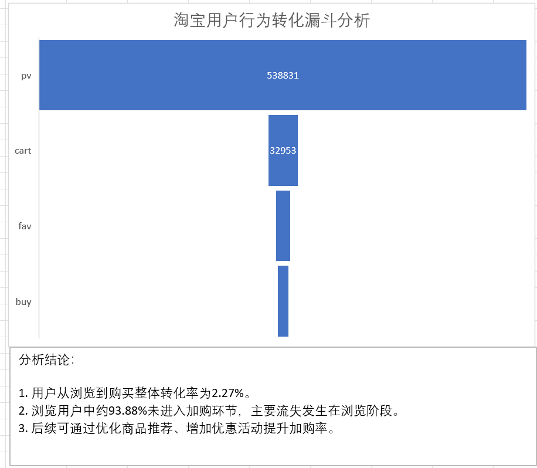
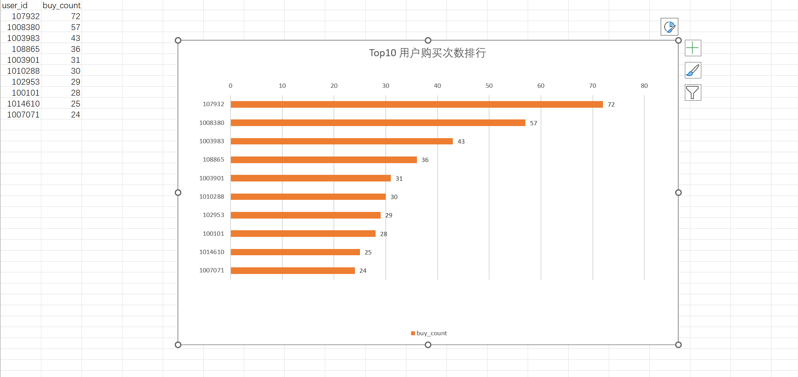
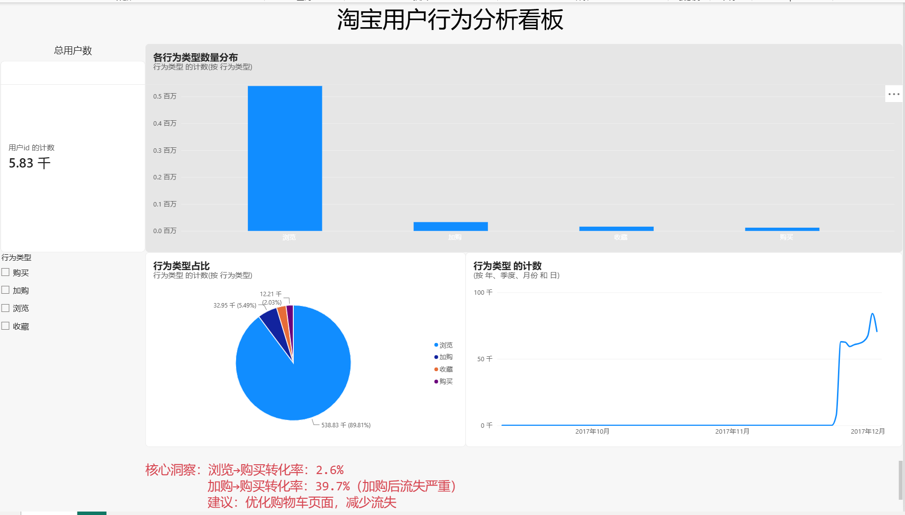

# 淘宝用户行为数据分析项目

## 1. 项目介绍

本项目基于淘宝用户行为公开数据集，通过 MySQL 对用户浏览、收藏、加购、购买等行为进行分析，并结合 Excel 与 Power BI 完成数据可视化展示。
项目主要围绕用户行为漏斗分析以及高频购买用户分析，探索用户从浏览商品到完成购买过程中的转化情况，并挖掘潜在高价值用户，为电商运营优化提供数据参考。
---

# 2. 项目背景

在电商平台中，用户通常会经历：
浏览商品 → 收藏商品 → 加入购物车 → 完成购买
通过分析不同阶段用户数量变化，可以了解用户流失情况，定位影响购买转化的关键环节。
同时，通过分析用户购买频次，可以识别高价值用户群体，为后续用户运营提供支持。
---

# 3. 数据说明

## 数据来源

淘宝用户行为公开数据集

## 数据表

| 表名 | 说明 |
|---|---|
| user_behavior | 用户行为记录表 |

## 字段说明

| 字段 | 含义 |
|---|---|
| user_id | 用户ID |
| item_id | 商品ID |
| category_id | 商品类别ID |
| behavior_type | 用户行为类型 |
| timestamp | 行为时间 |

## 用户行为类型

| 类型 | 含义 |
|---|---|
| pv | 浏览 |
| fav | 收藏 |
| cart | 加购 |
| buy | 购买 |

---

# 4. 使用工具

- MySQL
- Excel
- Power BI
- GitHub

---

# 5. 项目分析

## 5.1 用户行为漏斗分析

### 分析目标

统计不同用户行为发生次数，分析用户从浏览商品到最终购买过程中的转化情况。

---

### SQL分析

主要使用：

- GROUP BY
- COUNT()
- ORDER BY

统计不同用户行为数量。

---

### 分析结果

| 行为类型 | 数量 |
|---|---:|
| PV | 538831 |
| Cart | 32953 |
| Fav | 16007 |
| Buy | 12209 |

---
使用 Excel 对 SQL 输出结果进一步分析。

完成：

- 转化率计算
- 数据排序
- 条形图展示
- 用户购买排行分析

## 用户行为转化率

## Top购买用户分析

---

### 分析结论

- 用户浏览行为数量远高于购买行为，大量用户在浏览阶段流失。
- 浏览到购买整体转化率较低，需要关注用户购买路径优化。
- 加购用户仍存在流失，可以进一步优化购物流程。

---

# 5.2 高频购买用户分析

## 分析目标

通过统计用户购买次数，识别购买频次较高的用户群体。

---

## SQL分析

主要使用：

- WHERE筛选购买行为
- GROUP BY用户分组
- COUNT统计购买次数
- ORDER BY排序
- LIMIT获取Top用户

---

## 分析结果

得到购买次数最高的 Top10 用户。
---

## 分析结论

- 少部分用户存在较高购买频次。
- 高频购买用户可能属于高价值用户群体。
- 可以针对该类用户进行会员运营、精准推荐等策略。

---

# 6. Power BI 数据分析看板

基于用户行为数据构建 Power BI Dashboard，对用户规模、行为分布以及时间趋势进行可视化分析。

主要包含：

- 用户数量统计
- 各行为类型数量分布
- 用户行为占比分析
- 用户行为趋势分析

---

# 7. 项目结构
实习项目
│
├── data/ # 原始数据及分析结果
│ ├── UserBehavior.csv # 淘宝用户行为原始数据
│ ├── behavior_funnel.csv # 用户行为漏斗分析结果
│ └── top_buy_users.csv # 高购买用户分析结果
│
├── output/ # 数据清洗后的文件
│ └── user_behavior_cleaned.csv
│
├── images/ # 项目展示图片
│ ├── taobao.png # Power BI 用户行为看板
│ ├── funnel.png # 用户行为漏斗图
│ ├── top_user.png # Top购买用户分析图
│
├── powerBI/
│ └── 淘宝用户.pbix # Power BI分析文件
│
├── scripts/ # 数据处理脚本
│ ├── 01_data_clean.py # 数据清洗
│ ├── 02_data_import.py # 数据导入MySQL
│
├── sql/ # SQL分析代码
│ └── 01_behavior_analysis.sql
│
├── .gitignore # Git忽略文件
│
└── README.md # 项目说明文档
# 8. SQL分析内容

SQL文件：
sql/01_behavior_analysis.sql

包含：

### 1. 用户行为数量统计

分析不同用户行为发生次数。

### 2. 高频购买用户分析

统计购买次数最高的用户。

---

# 9. 项目总结

通过本项目完成了从数据查询、指标分析到可视化展示的数据分析流程。
主要实践：
- 使用 MySQL 进行数据查询与聚合分析
- 使用 SQL 完成用户行为分析
- 使用 Excel 完成分析结果整理与可视化
- 使用 Power BI 搭建数据分析看板
- 根据分析结果提出业务优化建议
后续可以进一步结合商品类别、用户分群以及时间周期等维度进行深入分析。